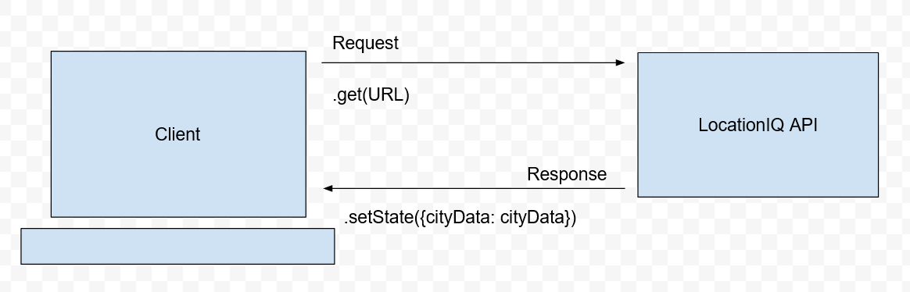

# City Explorer

**Author**: Isaiah Keller
**Version**: 1.0.1

## Overview
<!-- Provide a high level overview of what this application is and why you are building it, beyond the fact that it's an assignment for this class. (i.e. What's your problem domain?) -->
User can search a location and have the map data displayed.

## Getting Started
<!-- What are the steps that a user must take in order to build this app on their own machine and get it running? -->
- Uses:
    - axios
    - bootstrap
    - react-bootstrap

## Architecture
<!-- Provide a detailed description of the application design. What technologies (languages, libraries, etc) you're using, and any other relevant design information. -->
Web Request Response Cycle - Day 1

## Change Log
<!-- Use this area to document the iterative changes made to your application as each feature is successfully implemented. Use time stamps. Here's an example:

01-01-2001 4:59pm - Application now has a fully-functional express server, with a GET route for the location resource. -->

08-22-2022 2:00 pm site initiallized and deployed to netlify.

## Credit and Collaborations
<!-- Give credit (and a link) to other people or resources that helped you build this application. -->
- Collaborators:
     - Xavier Hillman

## Time Extimates

Name of feature: 

Estimate of time needed to complete: 

Start time: 

Finish time: 

Actual time needed to complete: 

Name of feature: 

Estimate of time needed to complete: 

Start time: 

Finish time: 

Actual time needed to complete: 

Name of feature: 

Estimate of time needed to complete: 

Start time: 

Finish time: 

Actual time needed to complete: 

Name of feature: 

Estimate of time needed to complete: 

Start time: 

Finish time: 

Actual time needed to complete: 

Name of feature: 

Estimate of time needed to complete: 

Start time: 

Finish time: 

Actual time needed to complete: 

Name of feature: 

Estimate of time needed to complete: 

Start time: 

Finish time: 

Actual time needed to complete: 

Name of feature: 

Estimate of time needed to complete: 

Start time: 

Finish time: 

Actual time needed to complete: 

Name of feature: 

Estimate of time needed to complete: 

Start time: 

Finish time: 

Actual time needed to complete: 

Name of feature: 

Estimate of time needed to complete: 

Start time: 

Finish time: 

Actual time needed to complete: 

Name of feature: 

Estimate of time needed to complete: 

Start time: 

Finish time: 

Actual time needed to complete: 

Name of feature: 

Estimate of time needed to complete: 

Start time: 

Finish time: 

Actual time needed to complete: 

