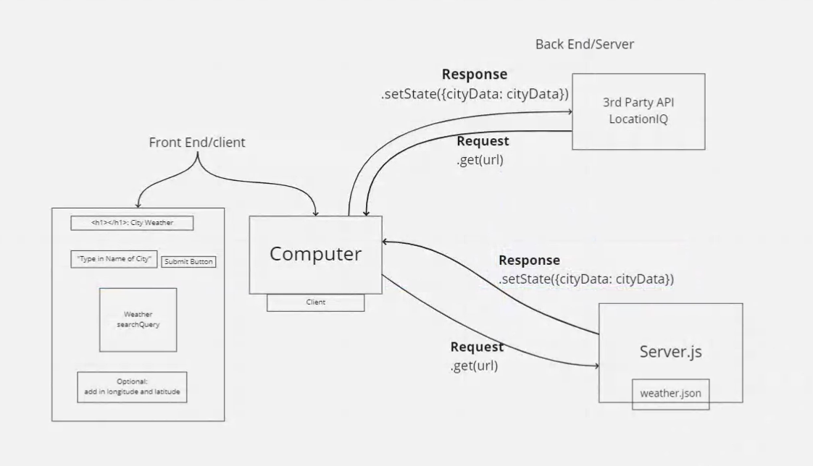

# City Explorer

**Author**: Isaiah Keller
**Version**: 1.0.25

[Deployed Site](https://steady-granita-1e3b50.netlify.app)
[Github Repo](https://github.com/ijkeller/city-explorer)

## Overview
<!-- Provide a high level overview of what this application is and why you are building it, beyond the fact that it's an assignment for this class. (i.e. What's your problem domain?) -->
User can search a location and have the map data displayed.

## Getting Started
<!-- What are the steps that a user must take in order to build this app on their own machine and get it running? -->
- Uses:
    - axios
    - bootstrap
    - react-bootstrap

## Architecture
<!-- Provide a detailed description of the application design. What technologies (languages, libraries, etc) you're using, and any other relevant design information. -->

Web Request Response Cycle - Day 1

Web Request Response Cycle - Day 2

## Change Log
<!-- Use this area to document the iterative changes made to your application as each feature is successfully implemented. Use time stamps. Here's an example:

01-01-2001 4:59pm - Application now has a fully-functional express server, with a GET route for the location resource. -->

08-22-2022 2:00 pm site initiallized and deployed to netlify.
08-23-2022 10:30 am app retrieving data from locationIQ and setting to state
08-23-2022 2:00 pm app retrieving map data and displaying searched location image on page.
08-23-2022 4:15 pm app styled and showing error message

## Credit and Collaborations
<!-- Give credit (and a link) to other people or resources that helped you build this application. -->
- Collaborators:
     - Xavier Hillman
     - Keelen Fisher
     - Tyler Main
     - 

## Time Extimates

Name of feature: 1: react repository and api keys

Estimate of time needed to complete: 1 hour

Start time: 1:00pm

Finish time: 2:00pm

Actual time needed to complete: 1 hour

Name of feature: 2: locations

Estimate of time needed to complete: 2 hours

Start time: 3:45 pm

Finish time: 10:30 am

Actual time needed to complete: 4 hours

Name of feature: 3: Map

Estimate of time needed to complete: 1 hour

Start time: 1:00 pm

Finish time: 2:00 pm

Actual time needed to complete: 1 hour

Name of feature: 4: Errors

Estimate of time needed to complete: 1 hour

Start time: 3:15 pm

Finish time: 4:15 pm

Actual time needed to complete: 1 hour

Name of feature: 5: Server Repository

Estimate of time needed to complete: 2 hours

Start time: 3:00 pm

Finish time: 4:45 pm

Actual time needed to complete: 1 hour 45 min

Name of feature: 6: Weather Placeholder

Estimate of time needed to complete: 2 hours

Start time: 5:00 pm

Finish time: 700 pm

Actual time needed to complete: 2 hours

Name of feature: 7: Errors

Estimate of time needed to complete: 30 min

Start time: 2:00 pm

Finish time: 2:30 pm

Actual time needed to complete: 30 min - had already started this during other steps

Name of feature: 8: Weather Live

Estimate of time needed to complete: 1.5 hours

Start time: 2:30 pm

Finish time: 4:00 pm

Actual time needed to complete: 1.5 hours

Name of feature: 9 Movies

Estimate of time needed to complete: 1 hour

Start time: 4:15 pm

Finish time: 5:15 pm

Actual time needed to complete: 1 hour

Name of feature: 10: Publish

Estimate of time needed to complete: 2 hours

Start time: 2:00 pm

Finish time: 5:54 pm

Actual time needed to complete: 4 hours

Name of feature: 

Estimate of time needed to complete: 

Start time: 

Finish time: 

Actual time needed to complete: 

Name of feature: 

Estimate of time needed to complete: 

Start time: 

Finish time: 

Actual time needed to complete: 

Name of feature: 

Estimate of time needed to complete: 

Start time: 

Finish time: 

Actual time needed to complete: 

Name of feature: 

Estimate of time needed to complete: 

Start time: 

Finish time: 

Actual time needed to complete: 

Name of feature: 

Estimate of time needed to complete: 

Start time: 

Finish time: 

Actual time needed to complete: 

Name of feature: 

Estimate of time needed to complete: 

Start time: 

Finish time: 

Actual time needed to complete: 

Name of feature: 

Estimate of time needed to complete: 

Start time: 

Finish time: 

Actual time needed to complete: 

Name of feature: 

Estimate of time needed to complete: 

Start time: 

Finish time: 

Actual time needed to complete: 

Name of feature: 

Estimate of time needed to complete: 

Start time: 

Finish time: 

Actual time needed to complete: 

